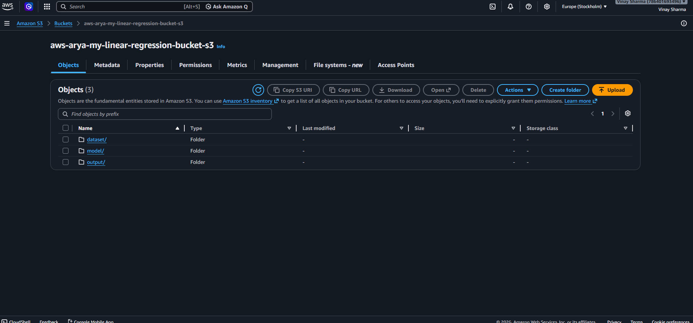
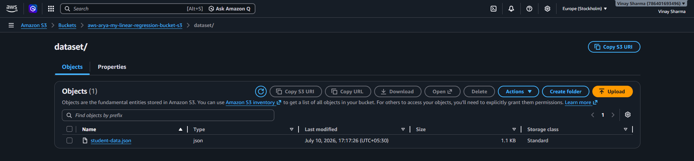
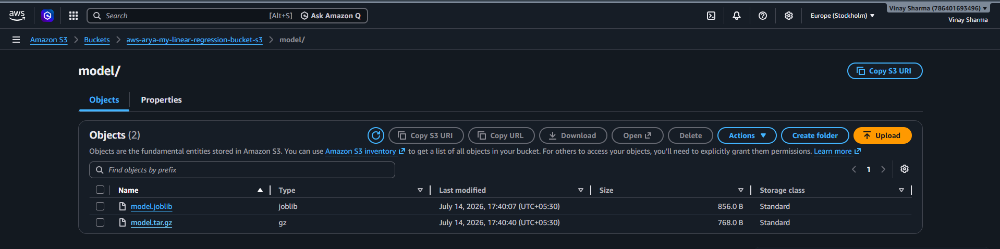
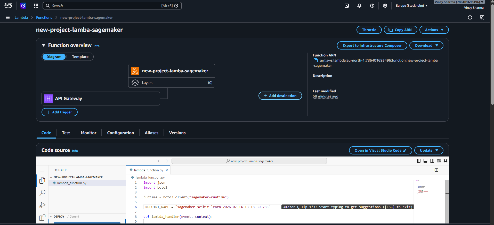
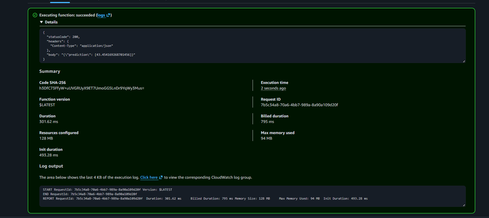
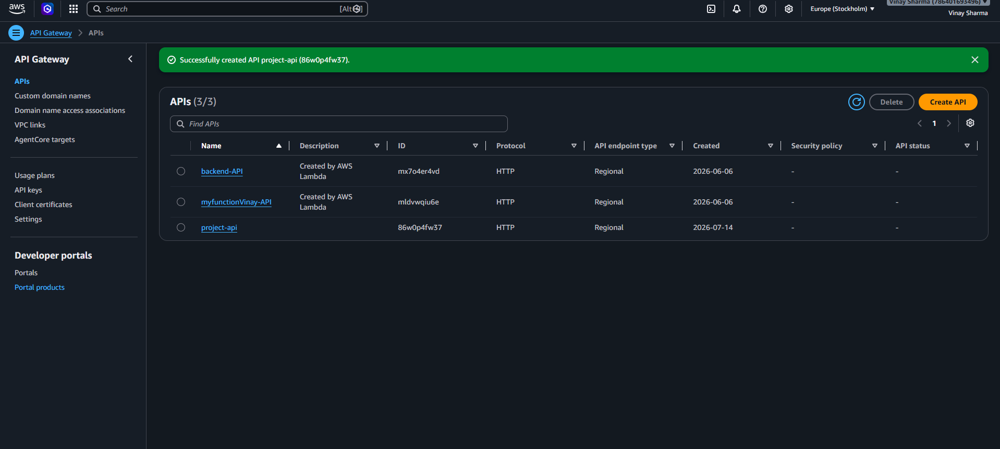
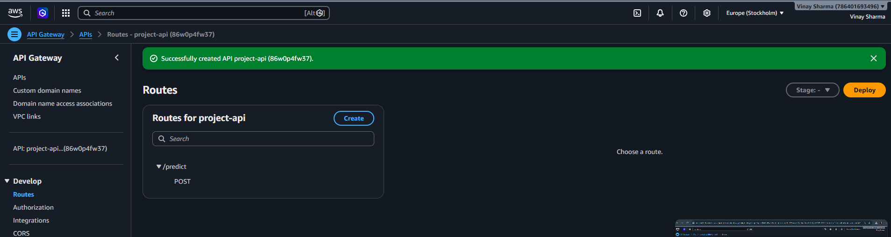
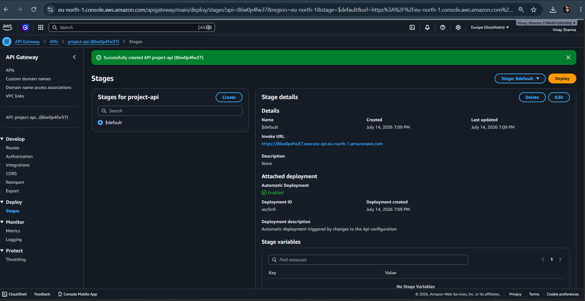
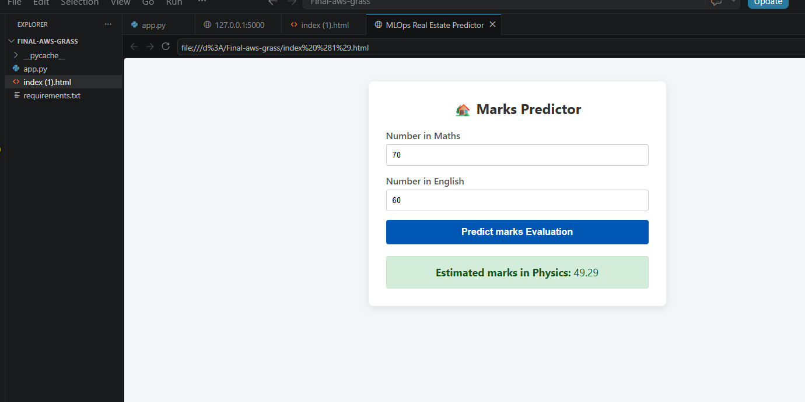
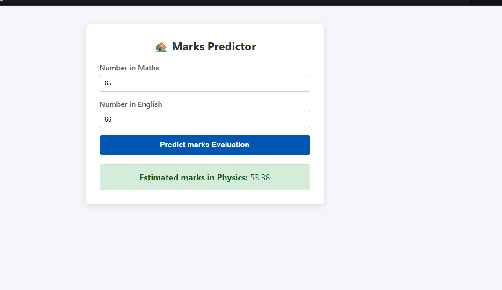

# 🎓 AWS MLOps Student Marks Predictor

> An end-to-end Machine Learning and MLOps project that evolved from a fully managed AWS cloud inference architecture into a containerized, cost-optimized production deployment on Amazon EC2.

The **AWS MLOps Student Marks Predictor** predicts a student's **Physics marks** using their **Maths and English marks**.

This project was developed in multiple phases. The first implementation used a complete AWS-based machine learning inference pipeline with **Amazon S3, Amazon SageMaker, AWS Lambda, Amazon API Gateway, FastAPI, and a web frontend**.

After successfully implementing the cloud inference workflow, the application architecture was further improved by:

- Containerizing the FastAPI application using Docker
- Deploying the application on Amazon EC2
- Configuring Nginx as a reverse proxy
- Connecting a custom domain
- Enabling HTTPS using Let's Encrypt and Certbot
- Replacing the continuously running SageMaker real-time endpoint with local model inference inside the Dockerized FastAPI application to reduce infrastructure cost

The final result is a complete project demonstrating both:

1. **Cloud-native machine learning deployment using AWS managed services**
2. **Cost-optimized containerized production deployment**

---

# 🌐 Live Application

## Production Website

```text
https://markspredictor.vinaysharmatech.xyz
```

The production application is hosted using:

```text
Custom Domain
      ↓
HTTPS / SSL
      ↓
Nginx Reverse Proxy
      ↓
Amazon EC2
      ↓
Docker Container
      ↓
FastAPI
      ↓
Scikit-learn Model
      ↓
Prediction
```

---

# 📌 Project Overview

The **AWS MLOps Student Marks Predictor** is an end-to-end machine learning deployment project designed to demonstrate the complete lifecycle of an ML application.

The machine learning model takes two input features:

- Maths Marks
- English Marks

and predicts:

- Physics Marks

The project began as a machine learning model deployment using a fully managed AWS inference architecture.

The original inference workflow was:

```text
Frontend
   ↓
FastAPI Backend
   ↓
Amazon API Gateway
   ↓
AWS Lambda
   ↓
Amazon SageMaker Real-Time Endpoint
   ↓
Machine Learning Model
   ↓
Prediction Response
```

This architecture successfully demonstrated how a machine learning model can be deployed using managed AWS services.

The project was later extended into a production web deployment using:

- Docker
- Amazon EC2
- Nginx
- Elastic IP
- Custom Domain
- HTTPS / SSL

Finally, the inference architecture was optimized to reduce the cost of maintaining a continuously running SageMaker real-time endpoint.

The current production architecture performs predictions directly using the trained `model.joblib` inside the Dockerized FastAPI application.

---

# 🔄 Project Evolution

One of the most important aspects of this project is that the architecture evolved through multiple stages.

The goal was not only to build a machine learning model, but also to understand different approaches to deploying and serving machine learning applications.

---

## Phase 1 — Machine Learning Model Development

The first stage focused on preparing the dataset and building the prediction model.

The dataset contains student academic performance data including:

```text
Student Name
Gender
Physics Marks
Maths Marks
English Marks
```

For the machine learning model:

```text
Input Features:
Maths + English

Target:
Physics
```

The model learns the relationship between a student's Maths and English performance and estimates the corresponding Physics marks.

The trained model was serialized using Joblib:

```text
model.joblib
```

This allowed the trained Scikit-learn model to be saved and reused without retraining the model every time the application starts.

---

## Phase 2 — AWS Cloud-Based ML Inference Architecture

After training the model, the next objective was to deploy it using AWS managed services.

The first complete cloud architecture was:

```text
┌──────────────────────────┐
│      HTML Frontend       │
│ Maths + English Inputs   │
└────────────┬─────────────┘
             │
             │ POST /predict
             ▼
┌──────────────────────────┐
│     FastAPI Backend      │
└────────────┬─────────────┘
             │
             │ HTTP Request
             ▼
┌──────────────────────────┐
│    Amazon API Gateway    │
└────────────┬─────────────┘
             │
             ▼
┌──────────────────────────┐
│        AWS Lambda        │
│  Serverless Integration  │
└────────────┬─────────────┘
             │
             │ invoke_endpoint()
             ▼
┌──────────────────────────┐
│    Amazon SageMaker      │
│   Real-Time Endpoint     │
└────────────┬─────────────┘
             │
             ▼
┌──────────────────────────┐
│   ML Model Prediction    │
└────────────┬─────────────┘
             │
             ▼
┌──────────────────────────┐
│   Prediction Response    │
└──────────────────────────┘
```

This version demonstrated a complete cloud-native machine learning inference workflow.

---

# ☁️ Initial AWS Architecture

## 1. Model Training

The machine learning model was trained using:

- Python
- Pandas
- NumPy
- Scikit-learn
- Jupyter Notebook

The trained model was serialized as:

```text
model.joblib
```

---

## 2. SageMaker Model Packaging

To deploy the trained model to Amazon SageMaker, the model was packaged into a compressed model artifact:

```text
model.tar.gz
```

The package contained the trained machine learning model required by the SageMaker inference container.

---

## 3. Amazon S3 Model Storage

The packaged model artifact was uploaded to an Amazon S3 bucket.

Example:

```text
Amazon S3
│
└── model/
    └── model.tar.gz
```

Amazon SageMaker used this model artifact during model deployment.

S3 provided centralized cloud storage for the trained machine learning model.

---

## 4. Custom SageMaker Inference Script

A custom inference script was created:

```text
Inference.py
```

The script implemented the SageMaker inference lifecycle:

```python
model_fn()
input_fn()
predict_fn()
output_fn()
```

### `model_fn()`

Loads the trained Joblib model from the SageMaker model directory.

### `input_fn()`

Receives the incoming JSON request and converts it into the format expected by the model.

Example:

```json
{
  "maths": 70,
  "english": 60
}
```

### `predict_fn()`

Runs the machine learning prediction.

### `output_fn()`

Converts the prediction into a JSON response.

---

## 5. Amazon SageMaker Real-Time Endpoint

The trained Scikit-learn model was deployed to an Amazon SageMaker real-time endpoint.

The endpoint provided a managed inference API capable of receiving prediction requests.

Example request:

```json
{
  "maths": 70,
  "english": 60
}
```

The deployed model generated an estimated Physics mark.

This stage demonstrated:

- SageMaker model deployment
- Model artifact loading from S3
- Custom inference handling
- Real-time machine learning inference

---

## 6. AWS Lambda Integration

AWS Lambda was used as the serverless integration layer between Amazon API Gateway and Amazon SageMaker.

The Lambda function:

1. Received the request from API Gateway
2. Parsed the request body
3. Used Boto3 to communicate with SageMaker
4. Invoked the SageMaker real-time endpoint
5. Received the model prediction
6. Returned the result to API Gateway

Core SageMaker invocation:

```python
response = runtime.invoke_endpoint(
    EndpointName=ENDPOINT_NAME,
    ContentType="application/json",
    Body=json.dumps(body)
)
```

This demonstrated serverless integration between AWS services.

---

## 7. Amazon API Gateway

Amazon API Gateway exposed the AWS Lambda function through an HTTP API.

The application sent prediction requests to:

```text
POST /predict
```

Example request:

```json
{
  "maths": 70,
  "english": 60
}
```

The request flow was:

```text
FastAPI
   ↓
API Gateway
   ↓
Lambda
   ↓
SageMaker Endpoint
   ↓
Prediction
```

---

## 8. FastAPI Backend

FastAPI was used as the application backend.

The backend:

- Validated user input using Pydantic
- Exposed REST API endpoints
- Communicated with the AWS inference architecture
- Returned prediction results to the frontend

Main endpoints:

```text
GET  /
GET  /ui
POST /predict
```

Example prediction request:

```json
{
  "maths": 70,
  "english": 60
}
```

Example response:

```json
{
  "status": "success",
  "prediction": 49.29
}
```

---

# 🖥️ Frontend Development

A web interface was created using:

- HTML5
- CSS3
- JavaScript
- Fetch API

The user enters:

```text
Maths Marks
English Marks
```

and clicks:

```text
Predict Marks Evaluation
```

The frontend sends a POST request to:

```text
/predict
```

The prediction returned by the FastAPI backend is displayed directly in the user interface.

Example:

```text
Maths Marks:   70
English Marks: 60

Predicted Physics Marks: 49.29
```

---

# 🐳 Phase 3 — Docker Containerization

After successfully implementing the AWS inference workflow, the application was containerized using Docker.

A `Dockerfile` was added to the project.

The Docker image contains:

- Python runtime
- FastAPI application
- Uvicorn server
- Python dependencies
- HTML frontend
- Trained `model.joblib`

The application is built using:

```bash
docker build -t student-marks-predictor .
```

The container can be started using:

```bash
docker run -d \
  --name student-marks-app \
  --restart unless-stopped \
  -p 8000:8000 \
  student-marks-predictor
```

The application runs internally on:

```text
0.0.0.0:8000
```

Docker provides:

- Application isolation
- Reproducible deployment
- Dependency consistency
- Easier migration between environments
- Simplified deployment on cloud infrastructure

---

# ☁️ Phase 4 — Amazon EC2 Deployment

The Dockerized application was deployed on an Amazon EC2 instance.

The deployment workflow became:

```text
GitHub Repository
        ↓
Amazon EC2
        ↓
Docker Image Build
        ↓
Docker Container
        ↓
FastAPI Application
```

The project repository was cloned onto the EC2 instance.

The Docker image was built directly on the server:

```bash
docker build -t student-marks-predictor .
```

The application container was started using:

```bash
docker run -d \
  --name student-marks-app \
  --restart unless-stopped \
  -p 8000:8000 \
  student-marks-predictor
```

The restart policy:

```text
--restart unless-stopped
```

allows Docker to automatically restart the container when appropriate, improving deployment reliability.

---

# 🌐 Phase 5 — Public Web Deployment

Initially, the application was accessible using the EC2 public IP and port:

```text
http://<EC2-PUBLIC-IP>:8000
```

However, directly exposing an application using an IP address and application port is not ideal for a production-style deployment.

The deployment was therefore improved using:

- Elastic IP
- Nginx
- Custom Domain
- HTTPS / SSL

---

# 📍 Elastic IP Configuration

An Elastic IP was allocated and associated with the EC2 instance.

This provided a stable public IPv4 address for the server.

Without an Elastic IP, the public IP address of an EC2 instance may change after a stop/start operation.

The Elastic IP allowed the custom domain to reliably point to the EC2 server.

---

# 🌍 Custom Domain Configuration

A custom subdomain was configured:

```text
markspredictor.vinaysharmatech.xyz
```

An `A` record was added to the DNS configuration:

```text
Type:  A
Host:  markspredictor
Value: <EC2 Elastic IP>
```

The DNS record directs traffic from:

```text
markspredictor.vinaysharmatech.xyz
```

to the Amazon EC2 instance.

---

# 🔄 Nginx Reverse Proxy

Nginx was installed on the EC2 instance and configured as a reverse proxy.

Instead of requiring users to access:

```text
http://<EC2-IP>:8000
```

Nginx receives standard web traffic and forwards it internally to the Dockerized FastAPI application.

The request flow became:

```text
User
  ↓
Domain
  ↓
Nginx
  ↓
127.0.0.1:8000
  ↓
Docker Container
  ↓
FastAPI
```

Nginx provides:

- Reverse proxy functionality
- Standard HTTP/HTTPS ports
- Custom domain routing
- SSL integration
- Cleaner public URLs

---

# 🔒 HTTPS and SSL

HTTPS was enabled using:

- Let's Encrypt
- Certbot
- Certbot Nginx Plugin

An SSL certificate was generated for:

```text
markspredictor.vinaysharmatech.xyz
```

The production application is therefore available securely over HTTPS.

```text
https://markspredictor.vinaysharmatech.xyz
```

The final network flow is:

```text
Browser
   ↓
HTTPS :443
   ↓
Nginx
   ↓
Docker / FastAPI :8000
   ↓
Machine Learning Model
```

---

# 💰 Phase 6 — Cost Optimization

The original AWS architecture successfully demonstrated a complete managed cloud inference workflow.

However, the architecture included a continuously running SageMaker real-time endpoint:

```text
Frontend
   ↓
FastAPI
   ↓
API Gateway
   ↓
Lambda
   ↓
SageMaker Real-Time Endpoint
   ↓
Model
```

For a small educational application with low traffic, maintaining a continuously running real-time endpoint can introduce unnecessary infrastructure cost.

Since the trained model was lightweight and could run efficiently inside the existing EC2 deployment, the inference architecture was optimized.

The trained:

```text
model.joblib
```

was loaded directly inside the FastAPI application.

The optimized architecture became:

```text
Frontend
   ↓
Nginx
   ↓
Docker Container
   ↓
FastAPI
   ↓
model.joblib
   ↓
Prediction
```

This removed the production application's runtime dependency on:

- Amazon SageMaker Real-Time Endpoint
- AWS Lambda
- Amazon API Gateway

The original AWS implementation remains an important part of the project because it demonstrates how the same machine learning model can be deployed using managed cloud services.

The optimized version demonstrates an additional engineering consideration:

> Choosing an architecture based not only on technical capability, but also on workload size, operational requirements, and infrastructure cost.

---

# 🏗️ Architecture Evolution

## Version 1 — Managed AWS ML Inference

```text
┌─────────────────────┐
│    Web Frontend     │
└──────────┬──────────┘
           │
           ▼
┌─────────────────────┐
│      FastAPI        │
└──────────┬──────────┘
           │
           ▼
┌─────────────────────┐
│    API Gateway      │
└──────────┬──────────┘
           │
           ▼
┌─────────────────────┐
│      AWS Lambda     │
└──────────┬──────────┘
           │
           ▼
┌─────────────────────┐
│ SageMaker Endpoint  │
└──────────┬──────────┘
           │
           ▼
┌─────────────────────┐
│     ML Model        │
└─────────────────────┘
```

### Advantages

- Fully managed ML inference
- Serverless API integration
- Scalable architecture
- Practical experience with multiple AWS services
- Demonstrates cloud-native ML deployment

### Consideration

For a small, low-traffic demonstration application, a continuously running real-time inference endpoint may not be the most cost-efficient serving option.

---

## Version 2 — Cost-Optimized Production Deployment

```text
┌──────────────────────────┐
│          User            │
└────────────┬─────────────┘
             │
             │ HTTPS
             ▼
┌──────────────────────────┐
│      Custom Domain       │
│ markspredictor...xyz     │
└────────────┬─────────────┘
             │
             ▼
┌──────────────────────────┐
│    Nginx Reverse Proxy   │
└────────────┬─────────────┘
             │
             ▼
┌──────────────────────────┐
│       Amazon EC2         │
│                          │
│   ┌──────────────────┐   │
│   │ Docker Container │   │
│   │                  │   │
│   │     FastAPI      │   │
│   │        ↓         │   │
│   │   model.joblib   │   │
│   └──────────────────┘   │
└──────────────────────────┘
```

### Advantages

- Lower infrastructure complexity
- Reduced inference cost
- Faster internal model access
- No external API call required for each prediction
- Docker-based reproducibility
- Custom domain
- HTTPS security
- Production-style reverse proxy
- Easier maintenance for a small application

---

# 🔁 Before vs After

| Component | Initial Architecture | Current Production Architecture |
|---|---|---|
| Frontend | HTML/CSS/JavaScript | HTML/CSS/JavaScript |
| Backend | FastAPI | FastAPI |
| Model Serving | SageMaker Real-Time Endpoint | Local `model.joblib` |
| API Layer | Amazon API Gateway | Direct FastAPI endpoint |
| Serverless Integration | AWS Lambda | Not required for current inference |
| Application Hosting | Local / API-based | Amazon EC2 |
| Containerization | Not initially used | Docker |
| Reverse Proxy | Not initially used | Nginx |
| Public Address | IP / API URL | Custom domain |
| HTTPS | Not initially configured | Let's Encrypt SSL |
| Runtime Model Cost | Managed endpoint cost | Runs within existing EC2 application |
| Deployment Style | Managed cloud inference | Containerized production deployment |

---

# 🔄 Current Production Request Flow

A prediction request now follows this path:

```text
1. User opens the HTTPS website
                ↓
2. Nginx receives the request
                ↓
3. Nginx forwards the request to FastAPI
                ↓
4. User enters Maths and English marks
                ↓
5. Frontend sends POST /predict
                ↓
6. FastAPI validates the request using Pydantic
                ↓
7. FastAPI creates the model input
                ↓
8. model.joblib performs the prediction
                ↓
9. FastAPI returns the prediction as JSON
                ↓
10. Frontend displays the predicted Physics marks
```

---

# 🧪 Example Prediction

## Input

```json
{
  "maths": 70,
  "english": 60
}
```

## Output

```json
{
  "status": "success",
  "prediction": 49.29
}
```

> The exact prediction depends on the trained machine learning model and dataset.

---

# 🛠️ Technology Stack

## Machine Learning

- Python
- NumPy
- Pandas
- Scikit-learn
- Joblib
- Jupyter Notebook
- Linear Regression

## Backend

- FastAPI
- Uvicorn
- Pydantic

## Frontend

- HTML5
- CSS3
- JavaScript
- Fetch API

## AWS Cloud

- Amazon EC2
- Amazon SageMaker
- Amazon S3
- AWS Lambda
- Amazon API Gateway
- AWS IAM
- Elastic IP

## DevOps and Deployment

- Docker
- Nginx
- Git
- GitHub
- Linux
- Let's Encrypt
- Certbot
- HTTPS / SSL
- DNS Configuration

---

# 📂 Project Structure

```text
AWS-MLOps-Student-Marks-Predictor-final/
│
├── screenshots/
│   ├── Lambda-Function-event-test-ss.png
│   ├── Lambda-Function.png
│   ├── Output1.png
│   ├── Output2.png
│   ├── S3-bucket-1.png
│   ├── S3-bucket-3.png
│   ├── Sagemaker-Ai-Lab ss.png
│   ├── api1.png
│   ├── api2.png
│   ├── api3.png
│   └── s3-bucket-2.png
│
├── Dockerfile
├── Inference.py
├── Lambda-Function.py
├── Untitled1.ipynb
├── app.py
├── index (1).html
├── model.joblib
├── model.tar.gz
├── requirements.txt
├── student-data.json
├── .gitignore
└── README.md
```

---

# 📄 Important Project Files

## `app.py`

The current FastAPI application.

Responsibilities:

- Loads `model.joblib`
- Serves the frontend
- Validates prediction input
- Runs local model inference
- Returns prediction results

---

## `model.joblib`

The trained Scikit-learn machine learning model currently used by the production application.

---

## `model.tar.gz`

The packaged model artifact created for the original Amazon SageMaker deployment.

---

## `Inference.py`

Custom inference logic used during the SageMaker deployment phase.

---

## `Lambda-Function.py`

AWS Lambda integration code used to invoke the SageMaker real-time endpoint.

---

## `Dockerfile`

Defines the containerized application environment used for the current Amazon EC2 deployment.

---

## `index (1).html`

The web frontend used to collect student marks and display the predicted Physics marks.

---

# ⚙️ Local Installation

## 1. Clone the Repository

```bash
git clone https://github.com/009vinaysharma/AWS-MLOps-Student-Marks-Predictor-final.git
```

Move into the project directory:

```bash
cd AWS-MLOps-Student-Marks-Predictor-final
```

---

## 2. Create a Virtual Environment

### Windows

```bash
python -m venv venv
venv\Scripts\activate
```

### Linux / macOS

```bash
python3 -m venv venv
source venv/bin/activate
```

---

## 3. Install Dependencies

```bash
pip install -r requirements.txt
```

---

## 4. Run the Application

```bash
python app.py
```

The application runs on:

```text
http://127.0.0.1:8000
```

---

## 5. Open the Frontend

```text
http://127.0.0.1:8000/ui
```

---

## 6. Open Swagger API Documentation

```text
http://127.0.0.1:8000/docs
```

Swagger UI can be used to test:

```text
POST /predict
```

Example:

```json
{
  "maths": 70,
  "english": 60
}
```

---

# 🐳 Docker Deployment

## Build the Docker Image

```bash
docker build -t student-marks-predictor .
```

## Run the Container

```bash
docker run -d \
  --name student-marks-app \
  --restart unless-stopped \
  -p 8000:8000 \
  student-marks-predictor
```

## Check Running Containers

```bash
docker ps
```

## View Application Logs

```bash
docker logs student-marks-app
```

## Stop the Container

```bash
docker stop student-marks-app
```

## Remove the Container

```bash
docker rm student-marks-app
```

---

# 🚀 Deployment Workflow

The current deployment process follows:

```text
GitHub Repository
        ↓
Clone Repository on Amazon EC2
        ↓
Build Docker Image
        ↓
Run Docker Container
        ↓
FastAPI on Port 8000
        ↓
Nginx Reverse Proxy
        ↓
Custom Domain
        ↓
HTTPS / SSL
        ↓
Public Production Application
```

---

# 🔐 Security Considerations

The project follows several important security practices:

- AWS credentials are not hardcoded in the application
- IAM roles are used for AWS service permissions
- HTTPS is enabled for the production website
- SSL certificates are managed using Certbot
- Nginx acts as the public-facing reverse proxy
- The FastAPI application runs behind Nginx
- Sensitive authentication tokens should never be committed to GitHub

For production environments, additional improvements should include:

- Restricting SSH access to trusted IP addresses
- Closing direct application ports when no longer required
- Using environment variables for configuration
- Applying least-privilege IAM permissions
- Adding application-level authentication where required

---

# 🧩 Challenges and Solutions

## Challenge 1 — SageMaker Endpoint Deployment

### Problem

Deploying a custom Scikit-learn model to SageMaker required correct:

- Model packaging
- S3 configuration
- IAM permissions
- Inference script structure
- Framework compatibility

### Solution

The model was packaged into:

```text
model.tar.gz
```

and deployed using a custom:

```text
Inference.py
```

script.

---

## Challenge 2 — Connecting Multiple AWS Services

### Problem

The prediction request needed to travel through:

```text
API Gateway → Lambda → SageMaker
```

### Solution

AWS Lambda was configured to invoke the SageMaker endpoint using Boto3, while API Gateway exposed the workflow through an HTTP API.

---

## Challenge 3 — Docker Port Configuration

### Problem

The application initially ran internally on a different host/port configuration, which prevented external access through Docker.

### Solution

The FastAPI/Uvicorn server was configured to listen on:

```text
0.0.0.0:8000
```

and the Docker container exposed the same port.

---

## Challenge 4 — EC2 Security Group Configuration

### Problem

The application could run successfully inside the EC2 instance but was not always externally accessible.

### Solution

The required inbound rules were configured for:

```text
22   → SSH
80   → HTTP
443  → HTTPS
8000 → Application testing
```

---

## Challenge 5 — Custom Domain and HTTPS

### Problem

The application was initially accessible only through an EC2 IP address and port.

### Solution

The deployment was improved using:

```text
Elastic IP
   ↓
DNS A Record
   ↓
Nginx
   ↓
Let's Encrypt SSL
```

This enabled a secure custom production URL.

---

## Challenge 6 — Reducing SageMaker Endpoint Cost

### Problem

A continuously running SageMaker real-time endpoint was unnecessary for a small educational application with limited traffic.

### Solution

The trained model was loaded directly inside the Dockerized FastAPI application.

The architecture changed from:

```text
FastAPI
   ↓
API Gateway
   ↓
Lambda
   ↓
SageMaker Endpoint
```

to:

```text
FastAPI
   ↓
Local model.joblib
```

This reduced the number of runtime services required for each prediction.

---

# ✨ Key Features

- End-to-end machine learning workflow
- Student Physics marks prediction
- Linear Regression model
- Scikit-learn model training
- Joblib model serialization
- SageMaker-compatible model packaging
- Amazon S3 model storage
- Custom SageMaker inference script
- SageMaker real-time endpoint deployment
- AWS Lambda integration
- Amazon API Gateway integration
- FastAPI REST API
- Pydantic input validation
- Interactive Swagger documentation
- HTML/CSS/JavaScript frontend
- Docker containerization
- Amazon EC2 deployment
- Elastic IP configuration
- Nginx reverse proxy
- Custom domain integration
- HTTPS using Let's Encrypt
- SSL certificate management using Certbot
- Local ML model inference
- Cost-optimized production architecture
- Git and GitHub version control

---

# 🎯 What This Project Demonstrates

This project demonstrates more than a single deployment approach.

It shows how the same machine learning application can evolve through different architectural decisions.

## Cloud ML Skills

- Amazon SageMaker deployment
- Amazon S3 model storage
- AWS Lambda integration
- API Gateway configuration
- IAM permissions
- Boto3-based AWS service communication

## Backend Skills

- REST API development
- FastAPI
- Pydantic validation
- Model inference integration

## DevOps Skills

- Docker image creation
- Docker container management
- Linux server deployment
- Amazon EC2 hosting
- Nginx reverse proxy configuration
- DNS configuration
- HTTPS and SSL setup

## Engineering Skills

- Debugging distributed cloud workflows
- Comparing deployment architectures
- Cost optimization
- Migrating model inference between architectures
- Maintaining backward project artifacts
- Building reproducible deployments

---

# 💡 What I Learned

Through this project, I gained hands-on experience with:

- Preparing machine learning datasets
- Training a regression model
- Serializing ML models using Joblib
- Packaging ML models for SageMaker
- Uploading model artifacts to Amazon S3
- Writing custom SageMaker inference logic
- Deploying models to SageMaker real-time endpoints
- Invoking SageMaker endpoints using Boto3
- Building serverless integrations using AWS Lambda
- Creating APIs using Amazon API Gateway
- Developing REST APIs using FastAPI
- Connecting a frontend to a machine learning backend
- Containerizing applications using Docker
- Deploying Docker containers on Amazon EC2
- Configuring EC2 Security Groups
- Using Elastic IP addresses
- Configuring DNS records
- Setting up Nginx as a reverse proxy
- Enabling HTTPS using Let's Encrypt and Certbot
- Debugging networking and deployment issues
- Optimizing cloud architecture based on application requirements and cost
- Managing source code using Git and GitHub

---

# 🔮 Future Improvements

Possible future improvements include:

- Add GitHub Actions for CI/CD
- Automatically deploy new versions after a successful GitHub push
- Add automated unit and API tests
- Add Docker Compose
- Add health checks for the Docker container
- Add application monitoring
- Add structured logging
- Add Amazon CloudWatch monitoring
- Add model versioning
- Add automated model retraining
- Add a larger real-world dataset
- Improve frontend responsiveness
- Add prediction history
- Add authentication and authorization
- Add Infrastructure as Code using Terraform
- Store Docker images in Amazon ECR
- Add automated rollback support
- Add model performance monitoring

---

# 📸 Project Screenshots

## Amazon SageMaker AI Lab


## Amazon S3 Bucket







## AWS Lambda Function



## AWS Lambda Test Event



## Amazon API Gateway







## Application Output





---

# 📊 Project Summary

The project evolved through the following journey:

```text
Dataset
   ↓
Machine Learning Model Training
   ↓
model.joblib
   ↓
SageMaker Model Packaging
   ↓
Amazon S3
   ↓
SageMaker Real-Time Endpoint
   ↓
AWS Lambda
   ↓
Amazon API Gateway
   ↓
FastAPI
   ↓
Web Frontend
   ↓
Docker Containerization
   ↓
Amazon EC2 Deployment
   ↓
Elastic IP
   ↓
Nginx Reverse Proxy
   ↓
Custom Domain
   ↓
HTTPS / SSL
   ↓
Cost Optimization
   ↓
Local Model Inference inside Docker
   ↓
Production Web Application
```

The project therefore demonstrates the complete progression from:

```text
Machine Learning Model
```

to:

```text
Managed AWS ML Inference
```

and finally to:

```text
Containerized, Secure, Cost-Optimized Production Deployment
```

---

# 👨‍💻 Author

**Vinay Sharma**

B.Tech — Computer Science & Engineering  
Specialization: Artificial Intelligence

Interested in:

- Machine Learning
- Data Science
- AWS Cloud
- MLOps
- AI Engineering
- Cloud Deployment

GitHub:

```text
009vinaysharma
```

---

# ⭐ Support

If you find this project useful, consider giving the repository a ⭐.

---

# 📄 Disclaimer

This project was created for educational and learning purposes.

The dataset is relatively small, so the predictions should be treated as a demonstration of:

- Machine learning model development
- AWS cloud deployment
- MLOps workflows
- API integration
- Docker containerization
- Cloud infrastructure deployment
- Production hosting
- Cost optimization

rather than as a production-grade academic prediction system.

---

# 🏁 Final Note

This project began as an experiment in deploying a machine learning model using managed AWS services.

It successfully implemented:

```text
Amazon S3
   ↓
Amazon SageMaker
   ↓
AWS Lambda
   ↓
Amazon API Gateway
```

The project was then expanded into a complete web deployment using:

```text
FastAPI
   ↓
Docker
   ↓
Amazon EC2
   ↓
Nginx
   ↓
Custom Domain
   ↓
HTTPS
```

Finally, the inference architecture was optimized by moving prediction directly into the Dockerized FastAPI application.

The final project demonstrates an important engineering principle:

> A successful system is not only one that works, but one whose architecture can evolve based on scalability, operational complexity, and cost requirements.
